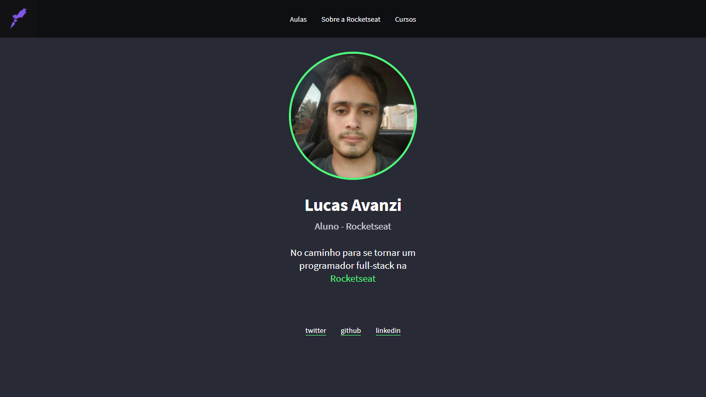
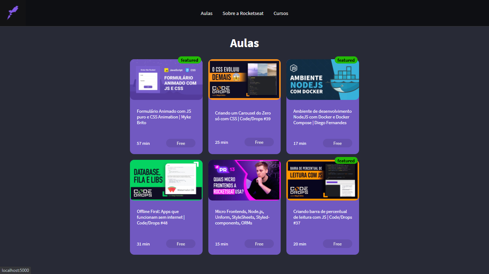
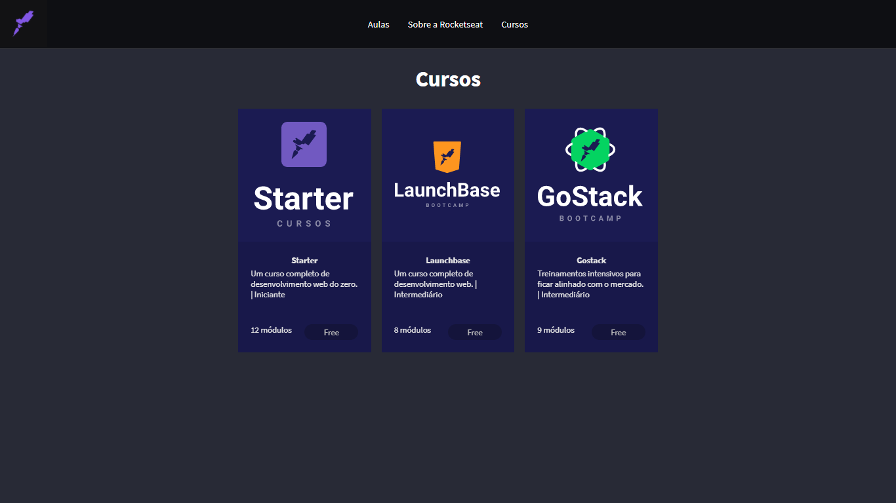
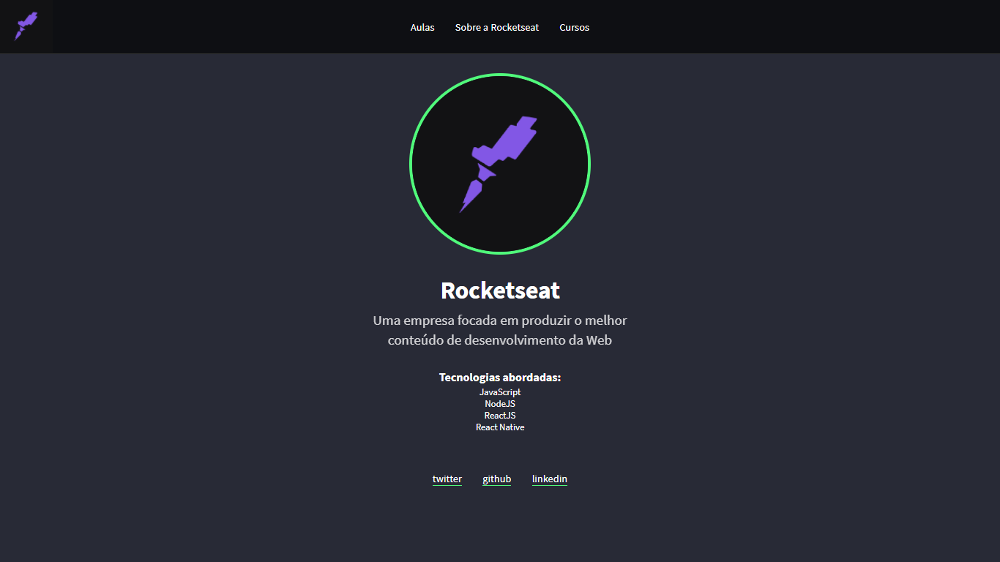

# :sparkles: Primeiro projeto como aluno da <a href="https://www.rocketseat.com.br/" target="_blank">Rocketseat</a> 

## Sobre
É um projeto bem simples de uma página pessoal do aluno, uma da empresa, e também páginas referente a aulas e cursos disponibilizados pela rocketseat. Apesar de simples, aborda conceitos importantes de programação Web, tanto da parte do front-end quanto back-end.

#### Tecnologias utilizadas
*HTML5, CSS3, JAVASCRIPT, NODE, Framework Express e Templating Engine Nunjucks

### Execução do projeto:
 1. Clonar o repositório no computador, após isso navegar até o diretório **"/Projeto"** e executar o comando "<strong>npm install</strong>" para instalar todas as dependências necessárias para rodar o projeto. :+1:
 2. Após a instalação das dependências, exercutar no terminal o comando **"npm start"** para iniciar o servidor. Feito isso, através do campo de url do navegador digitar **"localhost:5000"** e pronto, agora é só navegar pelo site. :+1:

### :art: :coffee: Alguns screenshots das telas:

